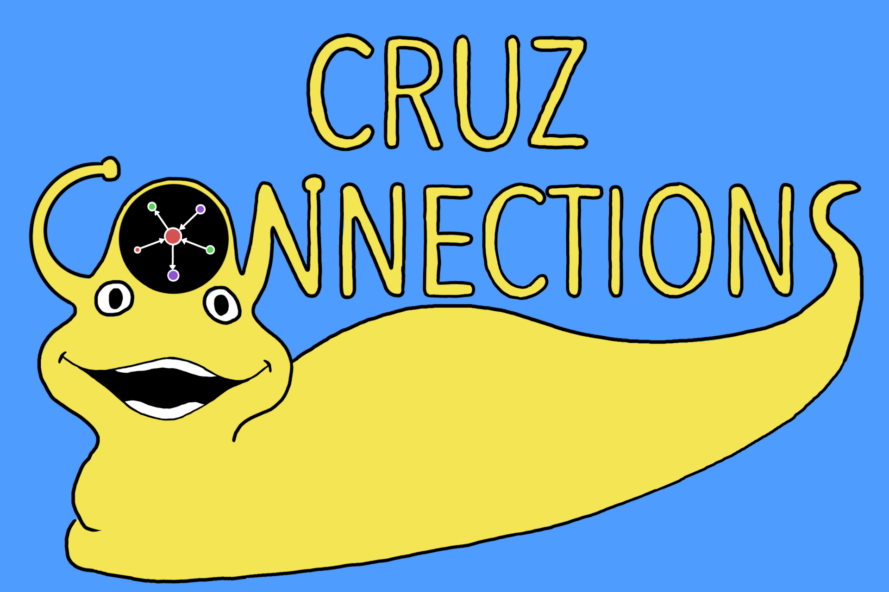

# Cruz Connections

## Click [here](http://cruzconnections.tech/) to view the app

## Inspiration
We wanted to see how the different classes we take at Santa Cruz could lead us down other paths (such as using math classes to take physics classes or taking chemistry classes to pursue biology).

## What it does
This app is an interactive 3D graph that allows you to see how courses and departments at UCSC are connected via prerequisites.

## How I built it
We collected UCSC course data using the SlugSurvival API. Then, we used a 3D Force Graph Javascript library to develop our graph visualization. Finally, we added additional search functionality and a UI to make our app as user-friendly as possible.

## Challenges I ran into
We found that it was very challenging to navigate our visualization initially. Additionally, our graph was very computationally intensive so we had to find ways to make it run as fast as possible. Through our performance optimizations, we were able to make the visualization much less laggy and improve the usability throughout the development process.

## Accomplishments that I'm proud of
I am really proud to have learned how to use object relations within CQL. Although our DataStax DB ended up not being connected to our website directly, I learned a lot about Cassandra and DataStax's Python driver throughout the hackathon.

## What I learned
I learned how to create interactive visualizations in JavaScript and how to use CQL.

## What's next for Cruz Connections
We hope to continue adding features so that Cruz Connections can be used as a class planning tool.